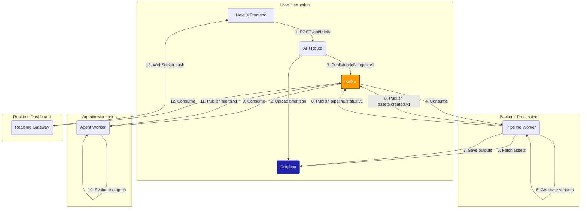
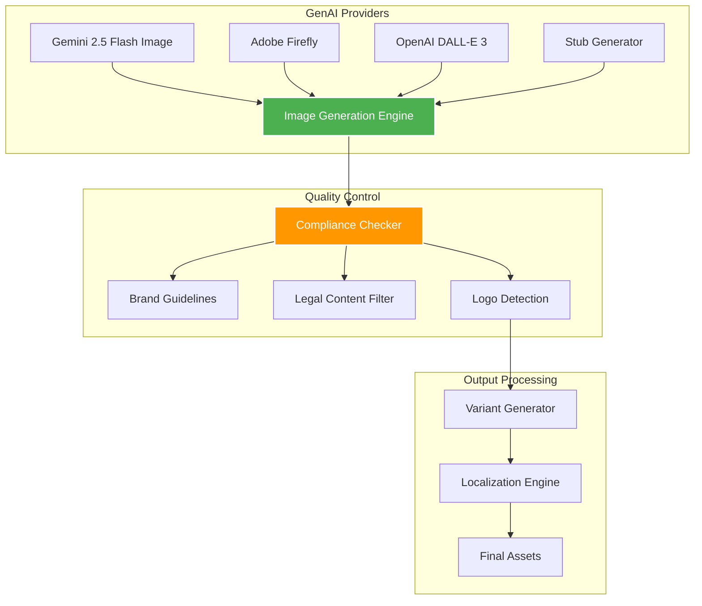
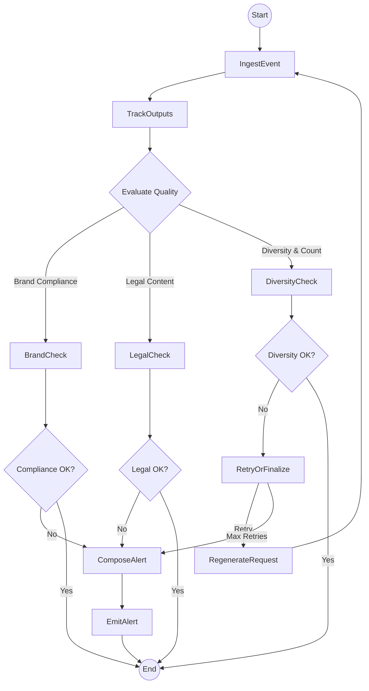
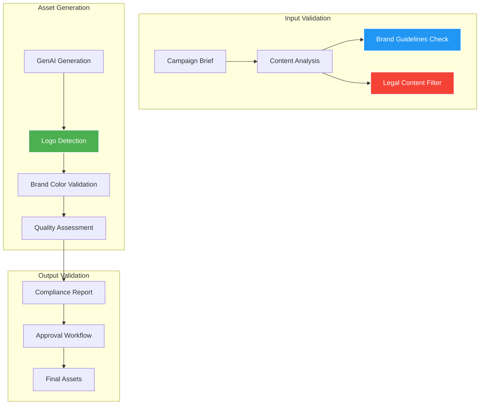

# Creative Automation Pipeline: Architecture

This document outlines the technical architecture of the Creative Automation Pipeline. It is composed of a frontend for user interaction, an event bus for decoupling services, several backend workers for processing, and cloud storage for assets.

## 1. System Components

The system is designed as a set of loosely coupled microservices communicating via a central event bus (Kafka).

- **Frontend (Next.js)**: A web application for uploading campaign briefs and viewing generated creatives. It acts as the primary user interface.
- **Realtime Gateway (Node.js)**: A WebSocket/SSE server that consumes status and alert events from Kafka and broadcasts them to the frontend for a live dashboard experience.
- **Pipeline Worker (Python)**: The core processing engine. It consumes new briefs, fetches or generates assets, creates variants, and saves them to Dropbox.
- **Agent Worker (Python)**: An AI agent built with LangGraph that monitors the pipeline's output, ensures creative diversity and volume, and triggers alerts or remediation actions.
- **Event Bus (Kafka/Redpanda)**: The central nervous system. All services communicate asynchronously by producing and consuming events from Kafka topics.
- **Storage (Dropbox)**: The single source of truth for all files, including briefs, raw assets, and final outputs.

## 2. Data Flow & Diagrams

### 2.1. High-Level Pipeline Flow

The following diagram illustrates the end-to-end flow, from a user submitting a brief to the final assets being generated and monitored.

### 2.2. Enhanced GenAI Integration Architecture

The system now supports multiple GenAI providers for image generation, with intelligent fallback and quality optimization.

### 2.3. Agent Worker (LangGraph) - Enhanced

The agent is a stateful graph that processes events and makes decisions. Each node represents a step in the agent's reasoning process.

### 2.4. Compliance and Quality Assurance Flow

## 3. Kafka Topics

- `briefs.ingest.v1`: Signals a new campaign is ready for processing.
- `pipeline.status.v1`: Provides real-time updates on the generation process.
- `assets.created.v1`: Announces the successful creation of a set of creative variants.
- `alerts.v1`: Carries human-readable alerts from the agent for system monitoring.
- `compliance.v1`: Reports on brand compliance and legal content checks.

## 4. Technology Stack

- **Frontend**: Next.js 14 (App Router), TypeScript, Tailwind CSS, shadcn/ui
- **Backend Workers**: Python 3.11, LangChain, LangGraph, Pydantic
- **Realtime Gateway**: Node.js, Kafkajs, ws
- **Event Bus**: Redpanda (local), Kafka (prod)
- **Storage**: Dropbox API
- **GenAI Providers**: Google Gemini 2.5 Flash Image, Adobe Firefly, OpenAI DALL-E 3
- **Image Processing**: Pillow (PIL), OpenCV
- **Compliance**: Custom brand guidelines engine, legal content filtering
- **Containerization**: Docker Compose

## 5. Security and Compliance

- **API Key Management**: Secure storage of GenAI provider API keys
- **Content Filtering**: Automated detection of prohibited content
- **Brand Protection**: Logo detection and brand guideline enforcement
- **Audit Trail**: Complete logging of all generation requests and compliance checks
- **Data Privacy**: Secure handling of campaign briefs and generated assets

## 6. Scalability Considerations

- **Horizontal Scaling**: Worker services can be scaled independently
- **Load Balancing**: Kafka partitions enable parallel processing
- **Caching**: Redis integration for frequently accessed assets and prompts
- **CDN**: CloudFront integration for global asset delivery
- **Monitoring**: Prometheus metrics and Grafana dashboards
